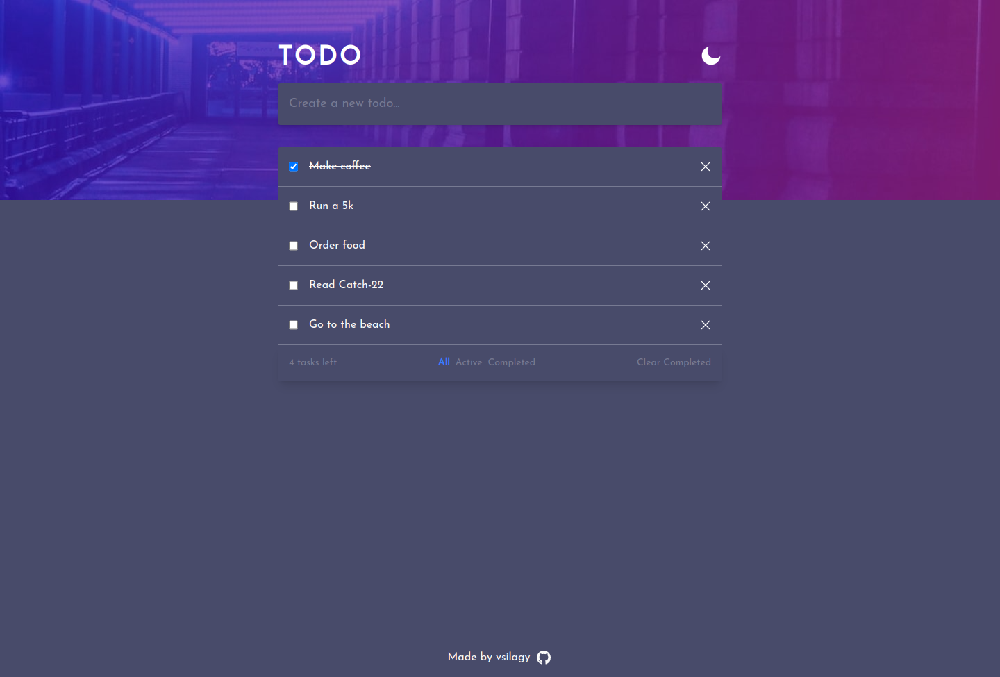

# Todo react

A todo list built with React, Tailwind and Vite

[Live Preview](https://todo-vs.netlify.app)

### Features

- add and remove todos
- check todos
- filter by "active" and "completed"
- clear completed todos
- save to localStorage
- darkMode

## Built with:

- [React](https://reactjs.org/)
- [Tailwind](https://tailwindcss.com/)
- [Vite](https://vitejs.dev/)
- [Netlify](https://www.netlify.com/)

### Resources

- for localStorage I used [useLocalStorage](https://usehooks.com/useLocalStorage/) hook
- for DarkMode I used [useDarkMode](https://omerduraker.medium.com/dark-and-light-mode-using-react-tailwind-css-58bb8f988080) hook
